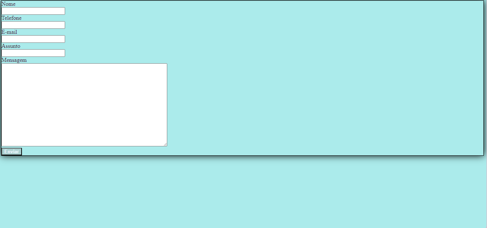
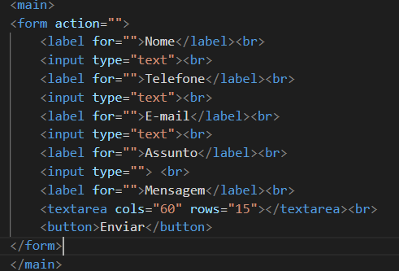

# projeto - página de contato

Projeto criado como parte da disciplina de fundamentos de Desenvolvimento, ministrada pelo professor Leonardo Rocha.

## índice

* [Descrição](#descrição)
* [Tecnologias](#tecnologias)
* [Referencias](#referencias)
* [Autor(a)](#autora)

## Descrição 

O projeto consiste na composição de uma página de contato para colocar informaçãoes pessoais e conseguir algum tipo de acesso.

### Resultado do projeto 



### Estilização

O projeto foi estilizado, utilizando CSS3. Foi criado um arquivo chamado main.css
Neste arquivo, constam as seguintes configurações de estilo:

* Estilo de cores - a cor de fundo utilizada no projeto foi definida como segue:

```
body{
    background-color: rgb(171, 235, 235);
}
```

O elemento citado acima foi utilizado nas seguintes classes do CSS3

* .form
* body - É para representar tudo o que aparece na página

O comportamento do elemento "body" na página foi definida como:

```
.body{
    display: flex;
 }
 ```
* Heigth -  propriedade height do CSS determina a altura da área do conteúdo de um elemento.
* font-weight -  A propriedade CSS font-weight especifica o peso ou a intensidade da fonte.
* box shadow - O box-shadow é uma propriedade do CSS, é utilizado para adicionar efeitos de sombra em volta de um elemento.
* color - A propriedade CSS color é utilizada para definir a cor do texto em um determinado elemento ou para toda a página HTML. 
* width - A propriedade CSS width determina a largura da área de conteúdo de um elemento. 
* Border - propriedade border adiciona um contorno ao redor do conteúdo do elemento HTML. 

Funções dos elementos utilizados no html:

* label - É utilizada para inserir interatividade em uma página ou formulário e tem como função executar uma determinada ação ao receber um clique do usuário. 
* button - ~´É utilizada para inserir interatividade em uma página ou formulário e tem como função executar uma determinada ação ao receber um clique do usuário. 
* input -  É usado para criar controles interativos para formulários baseados na web para receber dados do usuário.
* form -  É o elemento que formalmente define o formulário e os atributos que definem a maneira como esse formulário se comporta. Sempre que você desejar criar um formulário HTML, você deve iniciá-lo usando este elemento, colocando todo o conteúdo dentro deste.
* Meta - define qualquer informação de metadados que não podem ser definidos por outros elementos HTML.
* title - define o título do documento, mostrado na barra de título de um navegador ou na aba da página. 
* Main - define o título do documento, mostrado na barra de título de um navegador ou na aba da página. 
* Head - providencia informações gerais (metadados) sobre o documento, incluindo seu título e links para scripts e folhas de estilos.
* Link - especifica as relações entre o documento atual e um recurso externo.
* DOCTYPE - DOCTYPE é uma instrução para o navegador da web que diz em qual versão do HTML a página é escrita.
* Textarea - O Textarea é um campo de entrada de texto que permite que seu aplicativo aceite um valor de texto potencialmente longo do usuário.

Veja uma imagem de parte do código, onde é possivel indentificar o uso dos elementos acima:



## Tecnologias

* HTML
* CSS3
* README
* Git
* GitHub

## Referencias

[alura](https://www.alura.com.br/artigos/escrever-bom-readme)

## Autor(a)

 Projeto criado pela aluna:
 Ana Karoline Rodrigues Vieira

